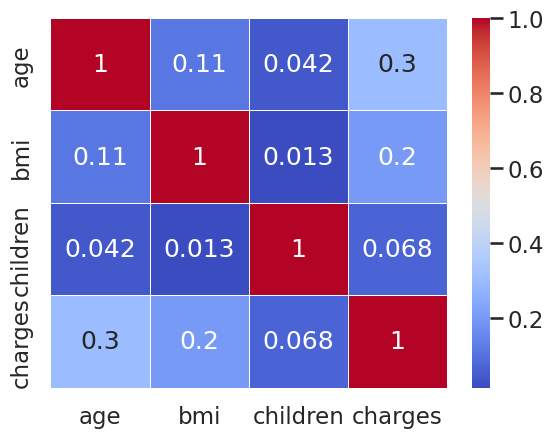
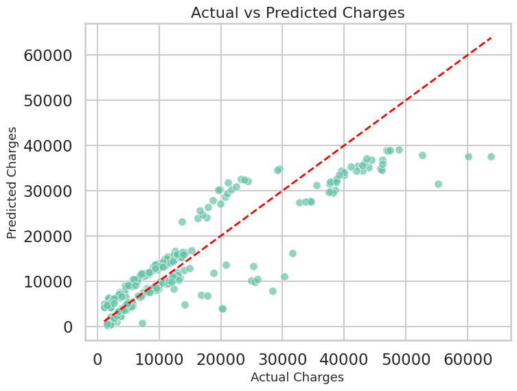
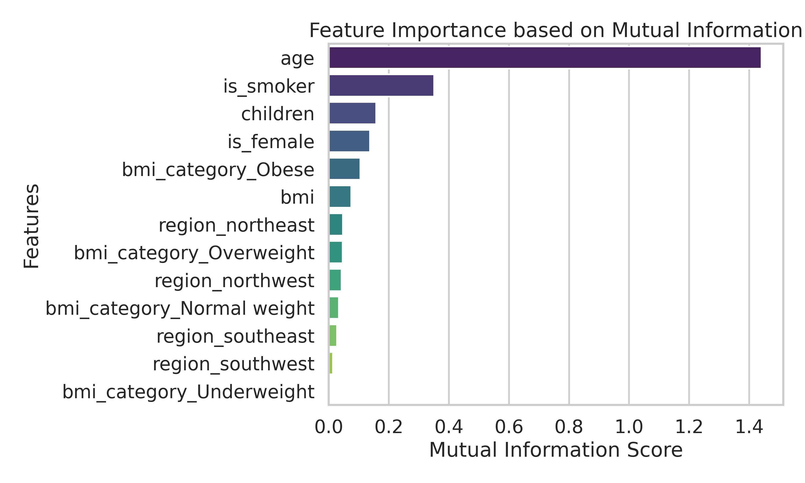

# 🏥 Insurance Charges Prediction using Linear Regression

## 📌 Project Overview

This project predicts medical insurance charges using a Linear Regression model. The complete machine learning pipeline was implemented, including data cleaning, exploratory data analysis (EDA), feature engineering, feature scaling, feature selection, model training, and evaluation.

---

## 📂 Folder Structure :

insurance_model/
├── images
│   ├── actual_vs_predicted_charges.png
│   ├── feature_importance.png
│   └── corr_heatmap.png
├── insurance.csv
├── insurance.ipynb
├── Readme.md
└── requirements.txt

## 📂 Dataset

The dataset contains demographic and health-related information about individuals, including:

- Age
- Gender
- BMI
- Number of Children
- Smoking Status
- Region
- Insurance Charges (Target)

---

## ⚙️ Technologies Used

- Python
- Pandas
- NumPy
- Matplotlib
- Seaborn
- Scikit-learn
- SciPy

---

## 🔍 Machine Learning Workflow

### 1. Data Cleaning

- Checked missing values
- Removed duplicates
- Verified data types

### 2. Exploratory Data Analysis (EDA)

- Distribution Analysis
- Correlation Analysis
- Boxplots
- Histograms
- Countplots

### 3. Feature Engineering

- One-Hot Encoding
- BMI Category Creation

### 4. Train-Test Split

- 80% Training Data
- 20% Testing Data

### 5. Feature Scaling

- StandardScaler

### 6. Feature Selection

- Pearsonr Correlation
- Mutual Information Regression

### 7. Model

- Linear Regression

## Visualizations

### Correlation Heatmap
The correlation heatmap visualizes the relationships between numerical features in the dataset. It helps identify positively and negatively correlated variables, providing insights into feature interactions before model training.

---

### Actual vs Predicted Charges
This scatter plot compares the actual insurance charges with the model's predicted values. The closer the data points are to the diagonal reference line, the better the model's predictive performance.

---

### Feature Importance
This chart displays the importance of each feature based on Mutual Information scores. Features with higher scores have a stronger relationship with the target variable and contribute more significantly to the prediction of insurance charges.

---

## 📊 Model Performance

| Metric | Value |
|---------|--------|
| R² Score | **80.35%** |
| Adjusted R² | **79.90%** |
| Mean Squared Error (MSE) | **36,103,448.76** |
| Root Mean Squared Error (RMSE) | **6008.61** |

---

## 📈 Results

The Linear Regression model explains approximately **80%** of the variance in insurance charges.

The small difference between the R² Score and Adjusted R² indicates that the selected features contribute effectively to the model without introducing unnecessary complexity.

---

## 👨‍💻 Author

**Ayyan Ahmed**

GitHub: https://github.com/code-with-ayyan